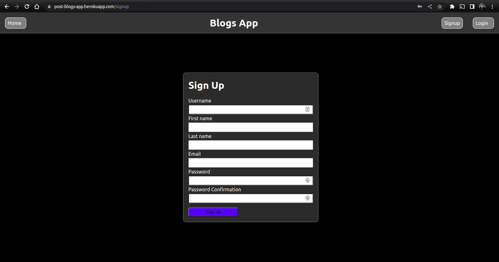
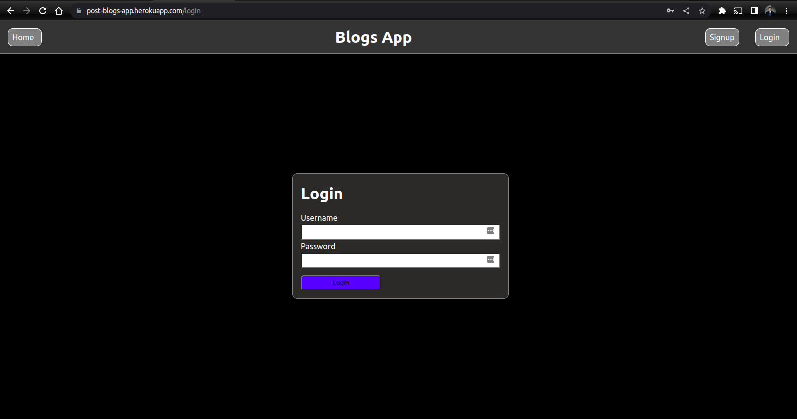
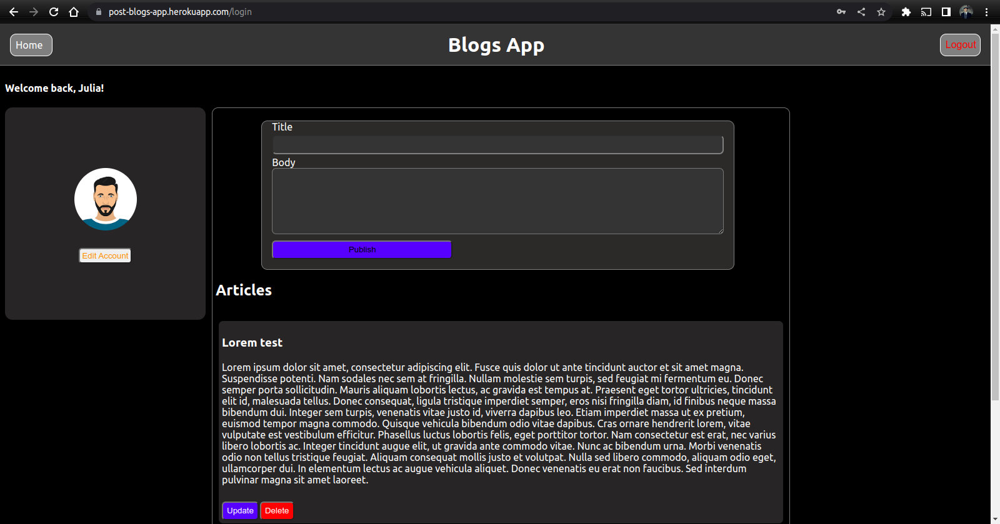

# Blog App

---

### Author : Earnest Achayo Date 13/10/2022

---

## Project Description

This is a blog website where users can manage their blogs. Users can also use this app as a personal blog keeping app and can be able to create, read, update and delete the bolgs.

---

## SCREENSHOTS

---

## SetUp Instruction

### Requirements

- Text editor eg [Visual Studio Code](https://code.visualstudio.com/download)

### Getting Files

- Fork the repo [LINK.](https://github.com/AchayoEarnest?tab=repositories)

* Create a new branch in your terminal (git checkout -b improve-feature)
* Install the prerequisites
* Make appropriate changes in file(s)
* Run the server to see the changes
* Add the changes and commit them (git commit -am "Improve App")
* Push to the branch (git push origin improve-app)
* Create a Pull request
* Remember to also for the server from [LINK.](https://github.com/AchayoEarnest/phase-3-personal-blog-react-sinatra-project-api) and run it under its README.md instructions

- Open the folder location on terminal and use the following command to run app:

### Features

- Users can create accounts and strore the personal information in the database
- Existing users in the database can log in and stay persisted in the system untill the logs out.
- Users can share their personal blogs and view them later.
- Users can perform CRUD operations(create, read, update, delete)

## How To Run It

> $ type 'rails start' on your text editor commandline and hit enter to start rails server.
> $ type 'npm start --prefix client' on your text editor commandline and hit enter to start react server.

---

## Live Link

Or you can access the web application directly via this [LINK.]()

---

## Technologies Used

1. JSX
2. CSS
3. React
4. Json
5. React Semantics
6. Postgresql
7. Rails

---

## Contact Information

- Email : earnest.achayo@student.moringaschool.com

---

## [License](LICENSE)

MIT License
Copyright (c) 2022 Earnest Achayo
